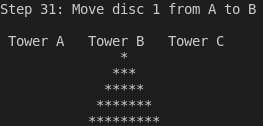

# Hanoi tower game

Hanoi tower game solved automaticaly by software developed in C.



## Usage

Download this project and compile it by typing the command `make` in its folder. Next, just run the executable `./hanoiTower`. You may pass as an argument the number of discs of the game (the minimum is 4 discs). Here is an example:

```
./hanoiTower 5
```
